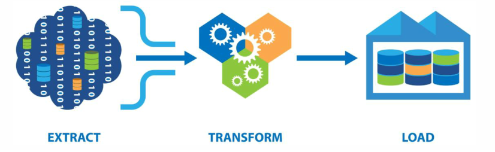
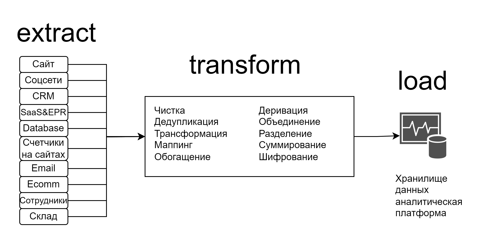
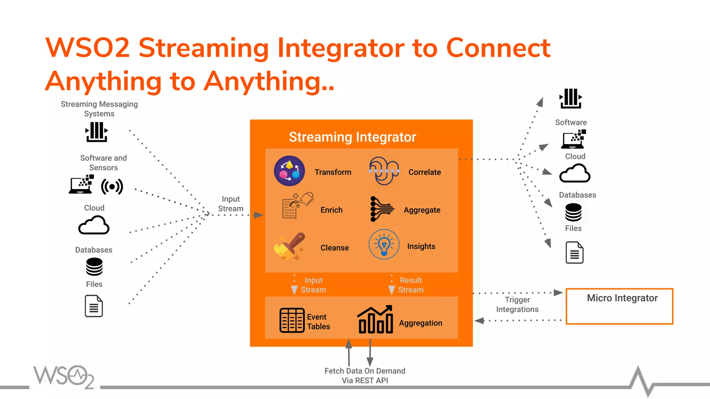
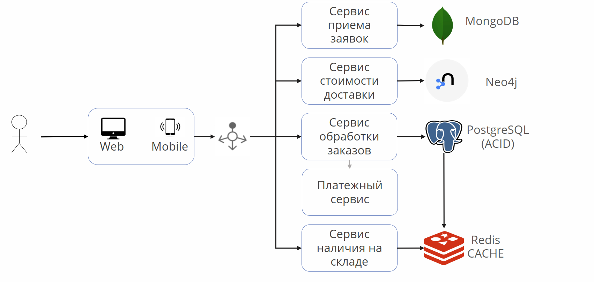
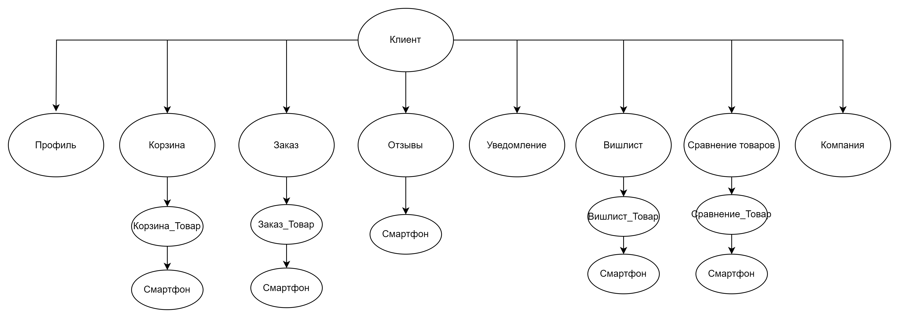
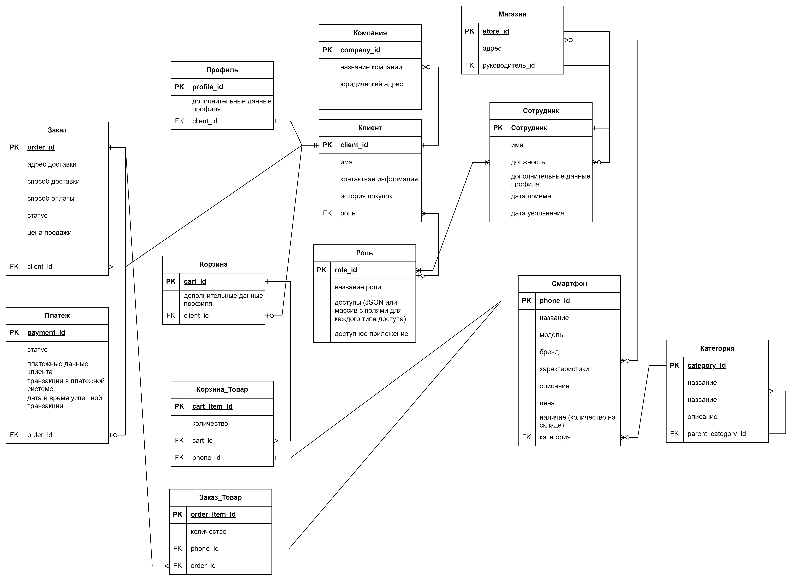
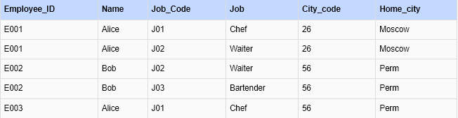

1. Нарисуйте архитектуру ETL процесса для сбора и анализа данных компанией которая хочет провести маркетинговую кампанию, используя app.diagrams.net. Сделайте описание почему вы считаете что архитектура должна выглядеть именно так.

Использование архитектуры на базе WSO2 может быть предпочтительным выбором.
- подходит для интеграции с широким спектром источников данных и сервисов.
- подходит для средних и крупных проектов с умеренными требованиями к производительности.
- имеет инструменты для обработки данных в реальном времени
- имеет мощные возможности для управления API, включая контроль доступа, мониторинг и аналитику.
- меньше сложность внедрения по сравнению c системами обмена очередей RabbitMQ / Kafka и Airflow, так как предоставляет комплексные решения «из коробки».
- подходит для компаний, которые нуждаются в мощных возможностях интеграции и управления API и имеют умеренные требования к производительности и обработке данных в реальном времени.

2. Постройте реляционную и иерархическую модели данных для магазина который продает телефоны.

- в процессе

3. Определите в какой нормальной форме данная таблица, приведите её ко 2 и 3 нормальным формам последовательно.

- в процессе
