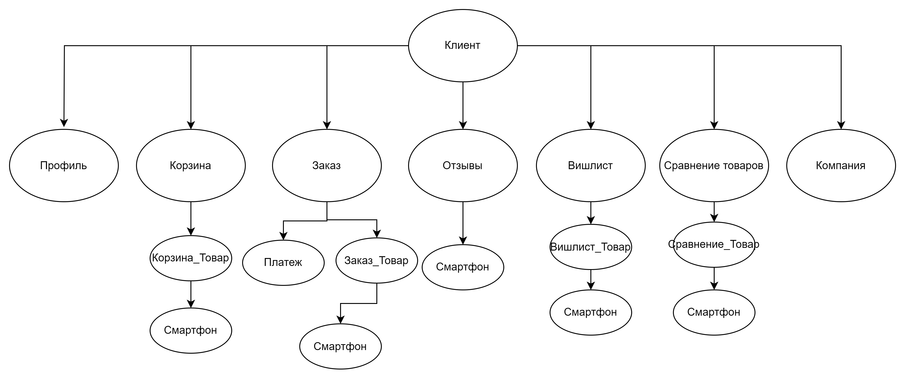
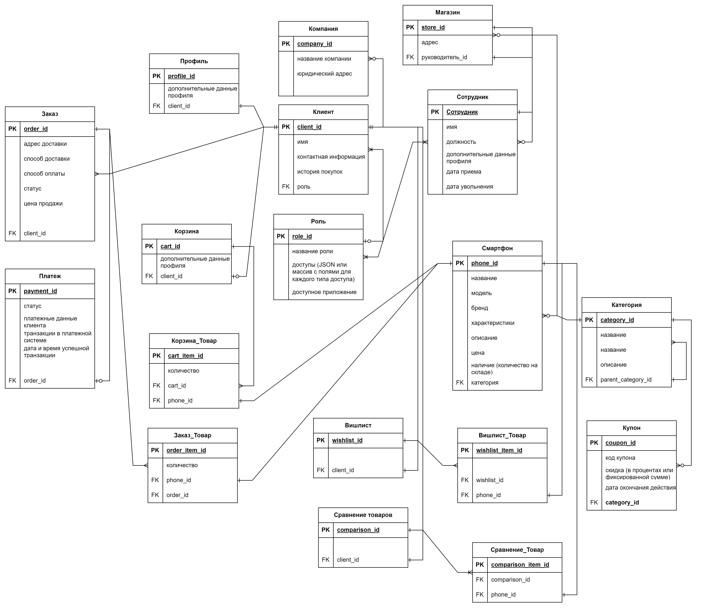

1. Нарисуйте архитектуру ETL процесса для сбора и анализа данных компанией которая хочет провести маркетинговую кампанию, используя app.diagrams.net. Сделайте описание почему вы считаете что архитектура должна выглядеть именно так.

Использование архитектуры на базе WSO2 может быть предпочтительным выбором.
- подходит для интеграции с широким спектром источников данных и сервисов.
- подходит для средних и крупных проектов с умеренными требованиями к производительности.
- имеет инструменты для обработки данных в реальном времени
- имеет мощные возможности для управления API, включая контроль доступа, мониторинг и аналитику.
- меньше сложность внедрения по сравнению c системами обмена очередей RabbitMQ / Kafka и Airflow, так как предоставляет комплексные решения «из коробки».
- подходит для компаний, которые нуждаются в мощных возможностях интеграции и управления API и имеют умеренные требования к производительности и обработке данных в реальном времени.

2. Постройте реляционную и иерархическую модели данных для магазина который продает телефоны.

3. Определите в какой нормальной форме данная таблица, приведите её ко 2 и 3 нормальным формам последовательно.

### Исходная таблица

| Employee_ID | Name  | Job_Code | Job       | City_code | Home_city |
|-------------|-------|----------|-----------|-----------|-----------|
| E001        | Alice | J01      | Chef      | 26        | Moscow    |
| E001        | Alice | J02      | Waiter    | 26        | Moscow    |
| E002        | Bob   | J02      | Waiter    | 56        | Perm      |
| E002        | Bob   | J03      | Bartender | 56        | Perm      |
| E003        | Alice | J01      | Chef      | 56        | Perm      |

### Анализ нормализации

#### 1NF (Первая нормальная форма)

Таблица находится в первой нормальной форме (1NF), если в ней отсутствуют повторяющиеся группы и все значения, хранимые в ней, неделимы (атомарны)

Исходная таблица находится в 1NF.

#### 2NF (Вторая нормальная форма)

