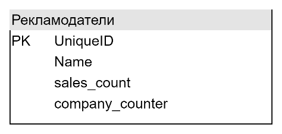

1. Денормализуйте таблицу так, чтобы не нужно было для каждого рекламодателя постоянно подсчитывать количество кампаний и продаж.

Денормализация заранее вычислив триггерами количество кампаний и продаж и сохранив их в таблице через создание агрегирующего атрибута

«Горизонтальное» агрегирующее отношение

2. В базе данных есть две таблицы: страны и клиенты. Одной из потребностей компании является исследование клиентов и стран с точки зрения эффективности продаж, поэтому часто выполняются объединения между таблицами: клиенты и страны. Что нужно сделать, чтобы ограничить частое объединение этих двух таблиц?

Денормализация через объединение схем отношений

3. Вернемся к первому примеру. Предположим, компания хочет регулярно извлекать данные о продажах, например, о кампаниях или рекламодателях с полными именами. Как мы можем решить проблему постоянной необходимости объединения таблиц?

Денормализация через объединение схем отношений

