1. Скачайте файл my_first_dag.py, поместите его в папку airflow/dags. Перезапустите airflow и запустите этот dag.

Установим последнюю версию airflow и базу postgres используя Docker и docker-compose

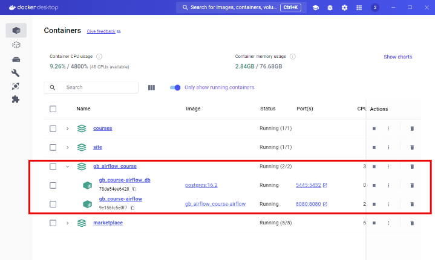

Для удобства работы с файлами расположение локальной папки./docker/dags:/usr/local/airflow/dags в volumes docker-compose. После перезапуска контейнера с airflow стартанем my_first_dag в интерфейсе

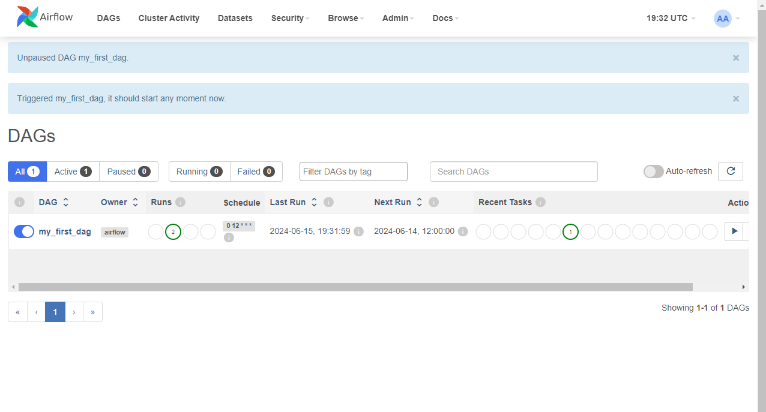

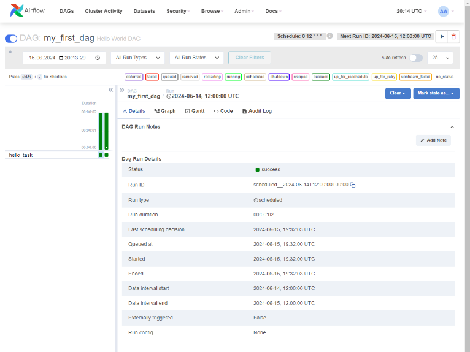

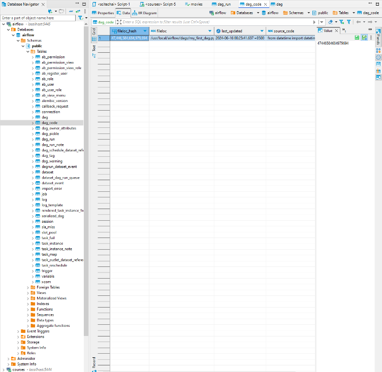

2. Посмотрите логи вывода.

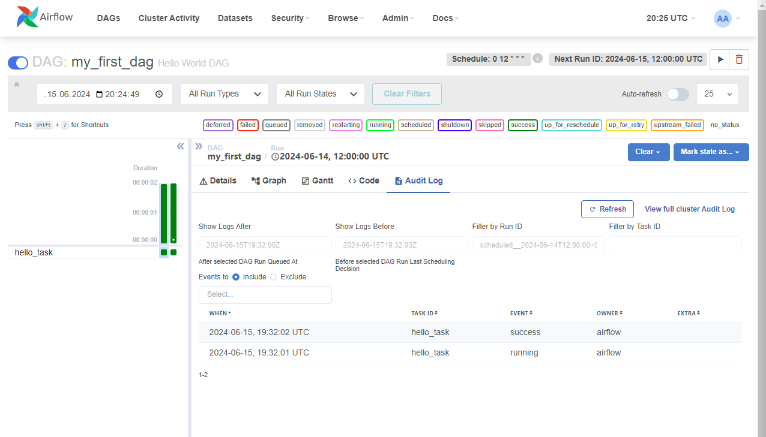

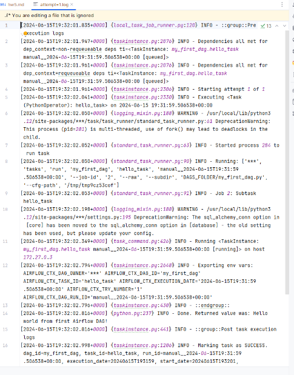

3. Измените этот dag так, чтобы он выводил в консоль текст «Привет + ваше имя». Посмотрите в логах, что dag выводит то, что вы хотите.

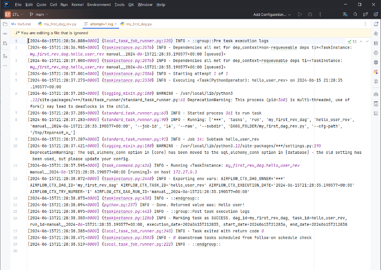

4. Скачайте файл my_second_dag.py поместите его в папку airflow/dags.
5. Объясните, что происходит в рамках этого процесса.

Этот код создает DAG для выполнения задач машинного обучения и выбора лучшей модели на основе их точности.

_train_model имитирует процесс обучения модели и возвращает случайное число от 1 до 10, представляющее точность модели.

_choosing_best_model используется для выбора лучшей модели на основе точности. Использует XCom для получения результатов выполнения задач с идентификаторами training_model_A, training_model_B, training_model_C.
Использует метод xcom_pull, который является обратной версией xcom_push, чтобы получить данные XCom из других задач.
Если максимальная точность среди моделей больше 8, возвращает строку "accurate", иначе возвращает "inaccurate". Это определяет дальнейший путь выполнения DAG.

Контекстный менеджер для создания объекта DAG имеет несколько обязательных аргументов:
- start_date=datetime(2021, 1, 1): указывает, с какой даты мы бы хотели запустить наш пайплайн
- schedule_interval="@daily": указывает, что DAG будет запускаться ежедневно. Это фактически CRON выражение, которое используется для определения времени запуска.
- catchup=False: означает, что пропущенные выполнения не будут догоняться, игнорируя все пропущенные даты запуска.

BranchPythonOperator в DAG - это оператор условие, чтобы определить дальнейший путь выполнения DAG, идентичен if else оператору в Python.

Модель А вернула 4, B-7, C-9 в этом случае choosing_best_model выберет "accurate", так как максимальная точность больше 8.

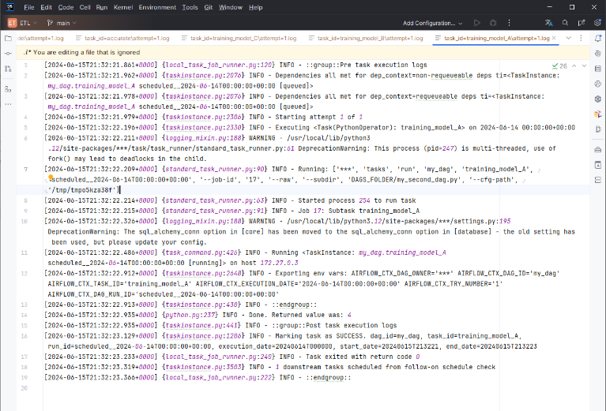
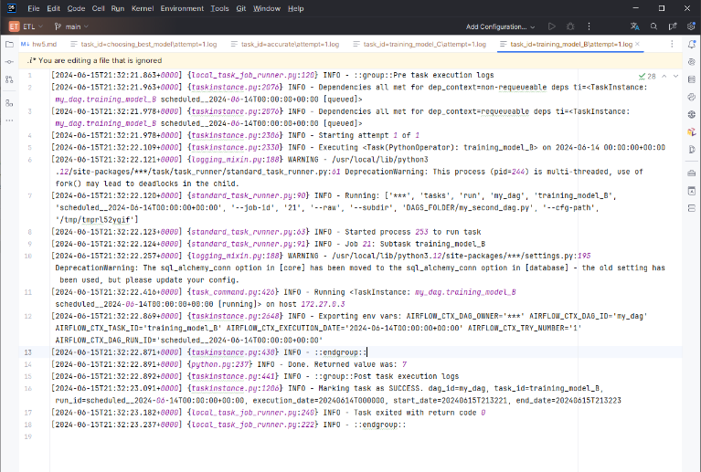
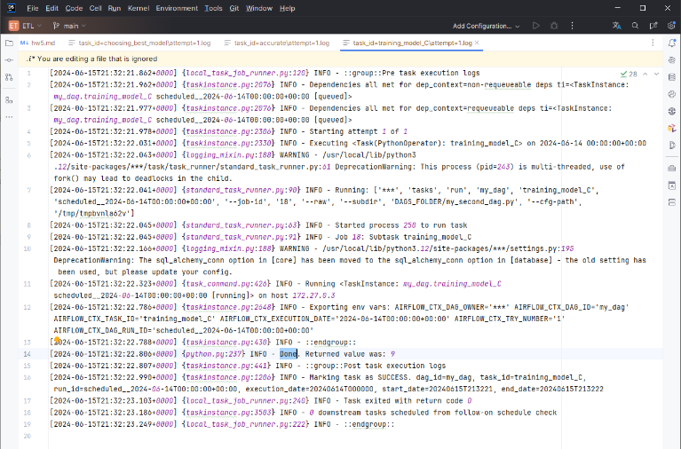
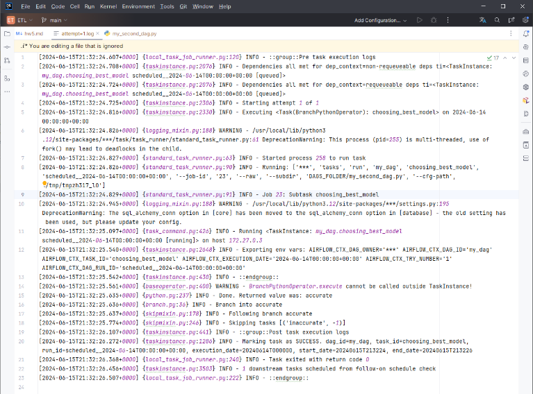
